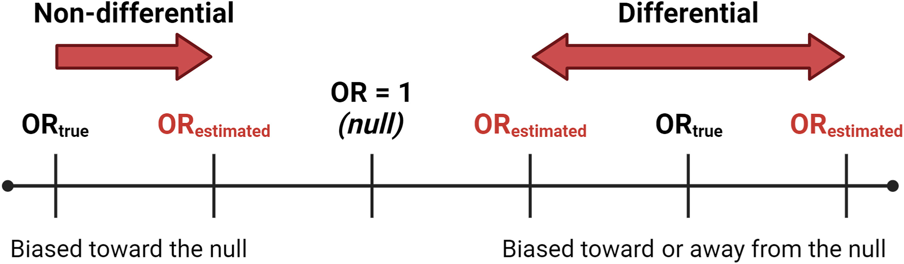

In [Lesson 3](lesson3.qmd) you cleaned and characterized your variables — checking distributions,
catching implausible values, and visualizing what you had. This lesson asks a question that comes
*before* all of that: how good is the exposure measurement itself?

Every environmental exposure in this course — NDVI, tree canopy, traffic density, poverty — is a
**proxy**. None of it is a direct measurement of what actually reached a person's lungs, skin, or
bloodstream. That gap between the true exposure and what we actually measured is called
**exposure misclassification**, and it is not a minor technical footnote — it changes what your
effect estimates mean and, in some cases, which direction they're biased in.

Even before that gap enters the picture, you face a second decision that's easy to overlook:
once you have a continuous exposure measurement — say, an NDVI value for every participant — how
should you actually use it in your analysis? Leave it as a continuous number? Split it into a
few categories, like "low/medium/high"? Collapse it into just two groups, "high" vs. "low"? This
is called an **exposure coding** decision, and it is not just a formatting choice: it trades off
how much statistical power you have to detect a real association, whether you can detect a
relationship that isn't a simple straight line, and how easy your results are to interpret and
communicate. Different coding choices can even lead to different conclusions from the *same*
underlying data — which is exactly why the decision needs to be made thoughtfully and justified,
not just defaulted to.

This lesson has two parts:

1. **Exposure coding** — given a continuous exposure measurement, how do you decide whether (and
   how) to categorize it, and what do you gain and lose with each choice? Worked example: NDVI,
   the same variable from Lessons 1 and 3.
2. **Exposure misclassification** — what happens to your effect estimate when the exposure you
   measured isn't quite the exposure that's real? Worked example: a purpose-built **simulated**
   dataset — data generated by a computer according to rules *we* set, rather than collected from
   real people — where we know the "true" exposure because we're the ones who created it. (More
   on what "simulated" means and why that's useful in Part 2.)

::: {.callout-important}
## How to use this tutorial

The gray boxes below are **live R editors** — the code actually runs in your browser (no install
needed). Click the green **Run Code** arrow in the top-left corner of a box to run it. The output
appears directly underneath a moment later.

You can edit the code first — click inside the box, change something, then click **Run Code**
again. Nothing you do here can break anything; refresh the page to start over if you make a mess.

Sections marked **🧠 Your Turn** give you a task and a blank or partially blank code editor. Try
writing the code yourself before revealing the solution, hidden in a collapsed box underneath.

**A note on browser vs. RStudio code:** chunks labeled `#| autorun: true` fetch data from the web
in the background so it's available in your browser. **You will not include this fetching code in
your own RStudio scripts.** Immediately after each one, a green box labeled **"In your RStudio
script"** shows the simpler code you'll actually use.
:::

::: {.callout-note}
## Doing this in RStudio instead of (or in addition to) the browser?

Part 1 continues from Lesson 1/3: it reads **`class_data_processed.csv`** from your
`data_processed/` folder. Part 2 introduces a **new, purpose-built dataset**,
`simulated_ozone_asthma_exposuremisclassification.csv` — save it to `data_raw/` in your own
project if you want to work through Part 2 in RStudio too. See the
[Data Codebook](codebook.qmd) for the class dataset's variables.
:::

---

# Part 1: Exposure Coding

As in every lesson, we start by loading `tidyverse` — the collection of packages that gives us
`%>%` and `mutate()` for working with data (used below to create our categorized exposure
variables) and `ggplot2` for the plots we'll make to visualize them.

```{webr-r}
library(tidyverse)
```

## Why coding decisions matter

Suppose you measure a continuous exposure — NDVI, ozone, traffic density, whatever it is. You now
face a choice that has nothing to do with the biology of the exposure and everything to do with
how you plan to model it:

- Leave it **continuous**?
- Split it into a small number of **categories** (tertiles, quartiles)?
- **Dichotomize** it into two groups (high/low)?

| Approach | What you gain | What you lose |
|---|---|---|
| **Continuous** (keep the raw numbers) | You keep every bit of information in the data, which gives you the best chance of detecting a real association if one exists — this is what people mean by "more statistical power." You can also model curved (not just straight-line) relationships if you use the right tools. | By default, a regression model assumes the relationship is a straight line (more exposure = proportionally more risk, all the way up and down the scale) unless you specifically tell it otherwise. A single number ("for each 1-unit increase in exposure...") can also be harder to explain to a general audience than "low/medium/high." |
| **Categorical (3+ groups, e.g., quartiles or tertiles)** | You can see whether risk jumps around unevenly across the range of exposure — for example, if only the *highest* group has meaningfully higher risk — without assuming a straight-line relationship. Easier to describe in plain language ("low/medium/high exposure"). | You need enough people in *each* group for your results to be reliable, and where exactly you draw the group boundaries is somewhat arbitrary. |
| **Binary (high vs. low)** | The simplest possible result to interpret and explain: two groups, one comparison. | You throw away the most information — everyone in "low" is treated as identical, even someone barely below the cutoff and someone far below it. Depending on where you draw the line, you can make a real relationship look stronger, weaker, or disappear entirely. |

There is no single correct answer. The right choice depends on your research question, how many
participants you have, what prior studies suggest about the shape of the relationship, and —
sometimes — a threshold that already has real-world meaning (e.g., the EPA's ground-level ozone
standard of 70 ppb over an 8-hour average). Whatever you choose, the decision should be
**transparent and justified**, not just whatever produced the most convenient result.

## Reading in our data

We pick up with `class_data_processed.csv`, the file from Lesson 1 with NDVI already merged in by
census tract. This will be our familiar **participant-level** dataset — one row per person, and
NDVI is one of many columns describing them.

We're also going to bring in a *second*, different file: `PHL_NDVI_summer_annual.csv`. This one
has nothing to do with our 2,000 participants directly — it's a separate, **tract-level** file
with one row per Philadelphia census tract (all 384 of them) and its NDVI value. Why look at
this at all? Because NDVI is measured at the *tract* level, not the individual level — every
participant living in the same tract shares the same NDVI value. Our participants only live in
some of the city's tracts, not a random sample of all of them, so it's worth checking: does the
range of greenness our participants actually experience look like the full range of greenness
found across the whole city, or is it narrower or shifted in some way? Answering that requires
comparing our participant data against this citywide tract-level file.

In RStudio:

```r
data <- read.csv(file.path("data_processed", "class_data_processed.csv"))
```

In the browser:

```{webr-r}
#| autorun: true

data_base_url <- "https://raw.githubusercontent.com/schinasi/EOH635/main/data/"

dir.create("data_processed", showWarnings = FALSE)

download.file(paste0(data_base_url, "class_data_processed.csv"), file.path("data_processed", "class_data_processed.csv"))
download.file(paste0(data_base_url, "PHL_NDVI_summer_annual.csv"), file.path("data_processed", "PHL_NDVI_summer_annual.csv"))

data <- read.csv(file.path("data_processed", "class_data_processed.csv"))
ndvi_PHL <- read.csv(file.path("data_processed", "PHL_NDVI_summer_annual.csv"))
```

::: {.callout-tip}
## 💻 In your RStudio script

```r
data <- read.csv(file.path("data_processed", "class_data_processed.csv"))
ndvi_PHL <- read.csv(file.path("data_raw", "PHL_NDVI_summer_annual.csv"))
```
:::

Let's confirm both files loaded the way we'd expect before going any further:

```{webr-r}
dim(data)      # participant-level data
dim(ndvi_PHL)  # one row per Philadelphia census tract
```

`dim()` reports rows first, then columns. `data` should show **2000 rows and 39 columns** — 2,000
participants, each described by 39 variables (including NDVI, already merged in from Lesson 1).
`ndvi_PHL` should show **384 rows and 2 columns** — one row for every census tract in Philadelphia,
with just two columns: a tract identifier and that tract's NDVI value. If your numbers don't match
these, something went wrong in the loading step above and it's worth tracking down before
continuing.

## Participant-level vs. city-level distribution of NDVI

Because our study participants don't live in a random sample of Philadelphia's 384 census tracts
— they live where they live — the distribution of NDVI *among participants* can differ from the
distribution *across the city*. If certain tracts are over- or under-represented in who happened
to enroll, our sample may not reflect the full range of greenness found citywide.

```{webr-r}
# Citywide distribution (384 census tracts)
summary(ndvi_PHL$X2015_NDVI)
```

```{webr-r}
# Distribution among our study participants
summary(data$X2015_NDVI)
```

**Questions to consider:**

- Is the range of NDVI similar in both distributions, or does one look narrower/shifted?
- If our participants are concentrated in a subset of tracts, what would that mean for how well
  our study represents "greenness exposure" across the whole city?

::: {.callout-note collapse="true" title="💡 Discussion — click to reveal after you've looked at both summaries yourself"}
The two distributions turn out to be quite similar. Citywide, NDVI ranges from about -0.03 to
0.35 (median ≈ 0.13); among participants, it ranges from about -0.03 to 0.35 as well (median ≈
0.12) — nearly identical minimums and maximums, with the participant distribution's median and
mean each only slightly lower than the city's. Participants also turn out to live in 363 of the
city's 384 tracts (about 95% of them) — not a narrow slice of the city at all.

That's good news for this particular exposure: it means our study sample is exposed to nearly the
full range of greenness found across Philadelphia, so conclusions about NDVI from this dataset are
likely to generalize reasonably well to the city as a whole. Had the two distributions looked very
different instead — say, if participants were clustered in only the greenest (or only the least
green) tracts — we'd be looking at a narrower slice of the exposure range than actually exists in
the population, which would limit how confidently we could generalize our findings city-wide, and
could also make it harder to detect a dose-response relationship if most of our variation in
exposure were compressed into a small range.
:::

## Categorizing NDVI into quartiles

Here's the code, walked through piece by piece:

- `mutate()` is the tidyverse function for **adding a new column** to a data frame — here, we're
  adding a column called `NDVI_quartile` to `data`.
- `ntile(X2015_NDVI, 4)` is what actually does the categorizing. It ranks every participant's
  NDVI value from lowest to highest, then splits them into **4** equal-sized groups — the number
  4 is simply the second argument we gave the function. It labels the lowest quarter of values
  `1`, the next quarter `2`, and so on up to `4` for the highest quarter. If we'd written
  `ntile(X2015_NDVI, 3)` instead, we'd get three equal-sized groups (tertiles) labeled 1–3 — we'll
  do exactly that in the next section.
- `data %>% mutate(...)` reads as "take `data`, then add this new column to it," and we save the
  result back into `data` so the new column sticks around for the rest of the tutorial.

```{webr-r}
# Convert NDVI into quartiles (1 = lowest, 4 = highest)
data <- data %>%
  mutate(NDVI_quartile = ntile(X2015_NDVI, 4))

table(data$NDVI_quartile)

ggplot(data, aes(x = factor(NDVI_quartile), y = X2015_NDVI)) +
  geom_boxplot(fill = "lightblue") +
  labs(x = "NDVI Quartile", y = "NDVI Value", title = "Distribution of NDVI by Quartile") +
  theme_minimal()
```

**Questions to consider:**

- `ntile()` splits the data into four *equal-sized* groups, by definition — because we told it to,
  with that `4`. What sample size do you see in each?
- What assumption are we making by treating everyone within Quartile 1 as having the "same"
  exposure, even though the raw NDVI values within that group still vary?

::: {.callout-tip title="🧠 Your Turn: Tertiles"}
Create a three-level categorical version of NDVI based on tertiles, name it `NDVI_tertile`, then
display and visualize its distribution the same way we just did for quartiles.
:::

```{webr-r}
# Your code here

```

::: {.callout-note collapse="true" title="💡 Solution — click to reveal"}
```{webr-r}
data <- data %>%
  mutate(NDVI_tertile = ntile(X2015_NDVI, 3))

table(data$NDVI_tertile)

ggplot(data, aes(x = factor(NDVI_tertile), y = X2015_NDVI)) +
  geom_boxplot(fill = "lightblue") +
  labs(x = "NDVI Tertile", y = "NDVI Value", title = "Distribution of NDVI by Tertile") +
  theme_minimal()
```
:::

Compare the tertile counts to the quartile counts from before: with only 3 groups instead of 4,
each tertile now contains *more* participants than each quartile did. But that larger group size
comes at a cost — each tertile now spans a *wider* range of actual NDVI values than a quartile
did, so it's a more coarse (less precise) summary of exposure. This is the general pattern any
time you use fewer categories: bigger, more stable groups, but each one is a blunter description
of what's really a continuous exposure.

## Dichotomizing NDVI: median vs. mean cut-points

A **median split** puts exactly half of participants in each group by definition. A **mean split**
is similar but is pulled around by extreme values — if the distribution is skewed, the mean and
median split can put quite different people into the "high" group.

::: {.callout-tip title="🧠 Your Turn: Median split"}
Create a binary variable `NDVI_high_median` that equals 1 if a participant's NDVI is above the
**median**, 0 otherwise. Then display the counts in each group.
:::

```{webr-r}
# Your code here

```

::: {.callout-note collapse="true" title="💡 Solution — click to reveal"}
```{webr-r}
data <- data %>%
  mutate(NDVI_high_median = ifelse(X2015_NDVI > median(X2015_NDVI, na.rm = TRUE), 1, 0))

table(data$NDVI_high_median)
```
:::

::: {.callout-tip title="🧠 Your Turn: Mean split"}
Now do the same thing using the **mean** instead of the median — call it `NDVI_high_mean`.
:::

```{webr-r}
# Your code here

```

::: {.callout-note collapse="true" title="💡 Solution — click to reveal"}
```{webr-r}
data <- data %>%
  mutate(NDVI_high_mean = ifelse(X2015_NDVI > mean(X2015_NDVI, na.rm = TRUE), 1, 0))

table(data$NDVI_high_mean)
```
:::

**Questions to consider:**

- Are the median-split and mean-split group sizes similar or different? What does that tell you
  about the shape of the NDVI distribution?
- What do you gain by dichotomizing (simplicity of interpretation)? What do you lose (variability,
  statistical power, the ability to detect a dose-response pattern)?
- Would a **fixed threshold** — say, NDVI > 0.3, chosen based on prior literature rather than this
  sample's own median — ever make more sense than a data-driven split? When would you want a
  threshold that doesn't depend on your own sample?

::: {.callout-note collapse="true" title="💡 Discussion — click to reveal after you've tried both splits yourself"}
**Median vs. mean split:** the median split comes out almost perfectly even (1,008 vs. 992 —
essentially half and half, which is exactly what a median split guarantees by definition). The
mean split is noticeably less even (1,104 vs. 896). That gap tells you something about the shape
of the distribution: the mean (≈ 0.131) is a bit higher than the median (≈ 0.120), which happens
when a distribution is **right-skewed** — most tracts cluster at low-to-moderate NDVI, with a
smaller number of much-greener tracts pulling the mean upward. Because more of the sample sits
below that higher mean value, fewer participants end up in the "high" group under a mean split.

**What you gain and lose by dichotomizing:** you gain simplicity — a single "high vs. low"
comparison is about as easy to interpret and communicate as a result gets. You lose the
variation *within* each group (someone just barely above the cutoff is treated identically to
someone with the highest NDVI in the whole sample), which costs you statistical power and can
hide a dose-response pattern entirely — if risk actually climbs gradually across the full range
of NDVI, a single high/low split will only ever show you the average difference between the two
halves, not the shape of that climb.

**Fixed threshold vs. data-driven split:** a sample-based split (median or mean) is relative to
*this* dataset — the "high" group here might not be "high" in a different city or a different
sample. A fixed threshold grounded in prior literature or a policy standard (like NDVI > 0.3, or
the EPA's ozone standard) instead reflects a threshold that means something on its own, independent
of your sample, which makes your results more directly comparable across studies and often more
directly relevant to policy. You'd reach for a fixed threshold when that kind of external
comparability matters more than describing this particular sample's own internal distribution.
:::

## A coding wrinkle: negative NDVI values

NDVI ranges from -1 to 1. Negative values indicate water, clouds, snow, or extreme barren land —
not "very low greenness" in the way a small positive value would mean. Should tracts with negative
NDVI be treated as just another point on the continuous scale, excluded, or coded as their own
category?

There is no universally correct answer — it depends on what negative NDVI *means* for your
research question. Here, we'll give it its own category rather than either lumping it in with the
lowest true-greenness tracts or discarding it outright:

```{webr-r}
data <- data %>%
  mutate(NDVI_quartile_neg = case_when(
    X2015_NDVI < 0 ~ 0,
    TRUE ~ ntile(X2015_NDVI, 4)
  ))

table(data$NDVI_quartile_neg)
```

Only a handful of participants fall in category 0. A cell that small can cause a regression model
to fail to converge later on — so, for this teaching example, we'll drop them:

```{webr-r}
new_data <- data %>%
  filter(NDVI_quartile_neg != 0)

dim(new_data)
```

**Questions to consider:**

- Does the row count in `new_data` match what you'd expect, given how many participants were in
  category 0?
- Dropping observations is not free — it changes who your study describes. Is dropping 7 people out
  of ~2,000 participants likely to matter much here? Would your answer change if it were 700 out of
  2,000?

---

# Part 2: Exposure Misclassification

Coding decisions assume you have an accurate measurement to begin with. Part 2 asks: what if the
exposure measurement itself has error?

**Exposure misclassification** occurs when a participant's true exposure status or level differs
from what was recorded. It comes in two flavors, and the distinction matters enormously for how
your results should be interpreted:

- **Non-differential misclassification**: the error in exposure measurement is unrelated to
  outcome status. Example: a study estimates each participant's air pollution exposure using
  the reading from the nearest monitor, but monitors are only scattered at a handful of fixed
  locations across a city — not everyone lives equally close to one. That means the monitor
  someone gets *assigned* often doesn't perfectly reflect the air they actually breathe at home,
  so some participants end up with a misclassified exposure value simply because of how far they
  happen to live from the nearest monitor. Critically, how far someone lives from a monitor has
  nothing to do with whether they developed the outcome — the error is essentially random noise
  with respect to the outcome, which is what makes it non-differential.
- **Differential misclassification**: the error in exposure measurement is systematically related
  to outcome status. Example: a case-control study of pesticide exposure and adverse birth
  outcomes relying on self-report — parents of an affected child may recall and report past
  pesticide exposure differently than parents of an unaffected child (recall bias).

**The consequences differ too:**

- Non-differential misclassification of a binary exposure **usually** biases the estimate
  **toward the null** — it dilutes a real association, making it look weaker than it truly is.
  This is the typical pattern, but it is not an absolute guarantee in every possible scenario
  (for example, with more than two exposure categories the math can get more complicated) — which
  is exactly why "usually" is doing real work in that sentence, not just hedging.
- Differential misclassification can bias the estimate **in either direction** — toward or away
  from the null — because the error itself depends on the very thing you're trying to measure the
  effect on.



## A simulated dataset where we know the truth

In a real study we never observe the *true* exposure alongside the *misclassified* one — if we
could measure the true value, we wouldn't have a misclassification problem. So how can we possibly
*show* what misclassification does to an estimate?

By using **simulated** data. A simulated dataset isn't collected from real people at all — it's
generated by a computer program that follows rules a researcher specifies in advance. For
example: "asthma risk increases with true ozone exposure according to this exact mathematical
formula, and then a second, 'measured' version of ozone is created by adding some random noise
to the true value." The "participants" aren't real children, but the relationships in the data
are built to resemble a real study closely enough to be a useful stand-in for one. The advantage
is total control: because we wrote the rules, we already know the ground truth — the *true*
relationship between ozone and asthma, and exactly how the misclassified versions were generated
from it — something that is never available in a real dataset. That lets us compare "true"
results against "misclassified" results directly, which is exactly what we need to see
misclassification's consequences with our own eyes rather than just taking the theory on faith.

To see those consequences, we'll use a dataset built specifically for this purpose: 500 simulated
children in Philadelphia, with **doctor-diagnosed asthma** (yes/no) as the outcome and **three
versions of the same ozone exposure** — the true value, and two different misclassified versions.

In RStudio:

```r
df <- read.csv(file.path("data_raw", "simulated_ozone_asthma_exposuremisclassification.csv"))
```

In the browser:

```{webr-r}
#| autorun: true

download.file(
  paste0(data_base_url, "simulated_ozone_asthma_exposuremisclassification.csv"),
  file.path("data_processed", "simulated_ozone_asthma_exposuremisclassification.csv")
)

df <- read.csv(file.path("data_processed", "simulated_ozone_asthma_exposuremisclassification.csv"))
```

::: {.callout-tip}
## 💻 In your RStudio script

```r
df <- read.csv(file.path("data_raw", "simulated_ozone_asthma_exposuremisclassification.csv"))
```
:::

```{webr-r}
names(df)
dim(df)
```

- **`true_ozone`** — the exposure we would never actually know in a real study, but we do here
  because we simulated it.
- **`nondiff_misclass_ozone`** — `true_ozone` plus random noise, added *regardless* of asthma
  status.
- **`diff_misclass_ozone`** — `true_ozone` plus noise added *only* for children with asthma —
  intentionally mimicking something like differential recall in a case-control design.
- **`asthma`** — doctor-diagnosed asthma by age 12 (1 = yes, 0 = no).

```{webr-r}
table(df$asthma)
```

## Comparing the three exposure measures

```{webr-r}
summary(df$true_ozone)
summary(df$nondiff_misclass_ozone)
summary(df$diff_misclass_ozone)
```

```{webr-r}
df_long <- df %>%
  select(true_ozone, nondiff_misclass_ozone, diff_misclass_ozone) %>%
  pivot_longer(everything(), names_to = "measure", values_to = "ozone")

ggplot(df_long, aes(x = measure, y = ozone, fill = measure)) +
  geom_boxplot() +
  labs(title = "True vs. Misclassified Ozone Exposure", x = NULL, y = "Ozone (ppb)") +
  theme_minimal() +
  theme(legend.position = "none")
```

**Questions to consider:**

- Do the three distributions look roughly similar overall? (They should — misclassification adds
  *noise* around the true value; it does not necessarily shift the average.)

## Does the misclassification differ by asthma status?

This is the key diagnostic question: does the size of the measurement error depend on the outcome?

::: {.callout-tip title="🧠 Your Turn"}
Compute `true_ozone - nondiff_misclass_ozone` and `true_ozone - diff_misclass_ozone` as two new
columns, then summarize each **separately for children with and without asthma** (`group_by(asthma)`
+ `summarise()`, or filter into two subsets — either approach works).
:::

```{webr-r}
# Your code here

```

::: {.callout-note collapse="true" title="💡 Solution — click to reveal"}
```{webr-r}
df <- df %>%
  mutate(
    diff_nondiff = true_ozone - nondiff_misclass_ozone,
    diff_diff = true_ozone - diff_misclass_ozone
  )

df %>%
  group_by(asthma) %>%
  summarise(
    n = n(),
    mean_error_nondiff = mean(diff_nondiff),
    sd_error_nondiff = sd(diff_nondiff),
    mean_error_diff = mean(diff_diff),
    sd_error_diff = sd(diff_diff)
  )
```
:::

**Questions to consider:**

- For the non-differential measure, is the size of the error similar for children with and
  without asthma?
- For the differential measure, is the error noticeably larger (or more variable) in one group?
  Given how this dataset was simulated — extra noise added specifically to children *with*
  asthma — does that match what you see?

## What does this do to our effect estimate?

We'll fit three logistic regression models — one per exposure measure — to estimate the
association between ozone and asthma. (We haven't covered regression modeling yet; the details of
`glm()` are not the point here. Focus on the **odds ratio** each model produces and how it compares
to the "true" one.)

```{webr-r}
model_true <- glm(asthma ~ true_ozone, data = df, family = binomial)
model_nondiff <- glm(asthma ~ nondiff_misclass_ozone, data = df, family = binomial)
model_diff <- glm(asthma ~ diff_misclass_ozone, data = df, family = binomial)
```

```{webr-r}
extract_or <- function(model, label) {
  b <- coef(model)[2]
  se <- sqrt(diag(vcov(model)))[2]
  data.frame(
    Model = label,
    OR = exp(b),
    CI_Lower = exp(b - 1.96 * se),
    CI_Upper = exp(b + 1.96 * se)
  )
}

bind_rows(
  extract_or(model_true, "True Ozone"),
  extract_or(model_nondiff, "Non-Differential Misclassification"),
  extract_or(model_diff, "Differential Misclassification")
)
```

An odds ratio of 1 is the null value — no association. Values above 1 indicate higher odds of
asthma with higher ozone; values below 1 indicate lower odds.

**Questions to consider:**

- Which OR is closest to the "true" one, and which is furthest?
- Does the non-differentially misclassified estimate move toward 1 (the null) relative to the
  true estimate, as the theory predicts?
- Does the differentially misclassified estimate move in a *predictable* direction, or does this
  example show why differential misclassification is harder to reason about in advance?
- If you only had the misclassified data in a real study — which is always true, since you never
  actually observe `true_ozone` — would you have any way of knowing which direction, or how far,
  your estimate had been pushed?

---

# Quick-Start Script for Your Own Project

::: {.callout-tip}
## 💻 In your RStudio script

```r
# ---- Setup ----
library(tidyverse)

# ---- Exposure coding ----
data <- read.csv(file.path("data_processed", "class_data_processed.csv"))

# Quartiles
data <- data %>% mutate(YOUR_EXPOSURE_quartile = ntile(YOUR_EXPOSURE, 4))
table(data$YOUR_EXPOSURE_quartile)

# Median split
data <- data %>%
  mutate(YOUR_EXPOSURE_high = ifelse(YOUR_EXPOSURE > median(YOUR_EXPOSURE, na.rm = TRUE), 1, 0))
table(data$YOUR_EXPOSURE_high)

ggplot(data, aes(x = factor(YOUR_EXPOSURE_quartile), y = YOUR_EXPOSURE)) +
  geom_boxplot(fill = "lightblue") +
  labs(x = "Quartile", y = "[Exposure label]", title = "[Exposure] by Quartile") +
  theme_minimal()

# ---- Exploring misclassification concepts ----
# There is no "true vs. misclassified" pair for your own project exposure -- that's exactly the
# point: in a real study you never observe ground truth. Use the simulated ozone/asthma example
# above to reason qualitatively about which kind of misclassification (differential or
# non-differential) is more plausible for how *your* exposure was measured, and in which
# direction it's likely to have biased your future regression estimates.
```
:::

---

# Wrap Up

- Exposure coding decisions (continuous, categorical, dichotomized) trade off statistical power
  and the ability to detect non-linear patterns against interpretability — there's no
  universally correct choice, only a justified one.
- Exposure misclassification is the gap between what you measured and what's actually true, and
  it comes in two kinds: **non-differential** (error unrelated to outcome status) and
  **differential** (error related to outcome status).
- Non-differential misclassification of a binary exposure usually biases toward the null.
  Differential misclassification can bias in either direction.
- Because we never observe ground truth in a real study, thinking carefully about *how* an
  exposure was measured — and what could make that error differ by outcome status — is often the
  only tool available for reasoning about the direction of bias.

**Next in the course:** regression modeling — how we actually estimate and interpret the
exposure-outcome associations we've been setting up to study since Lesson 2.
